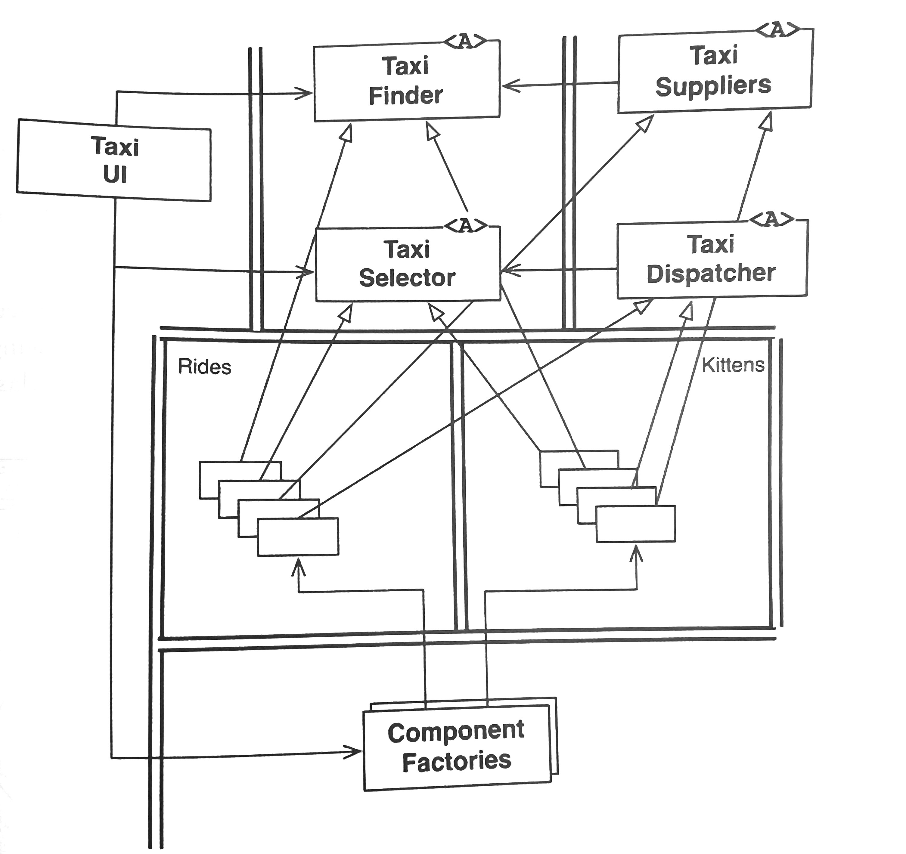

# Taxi Finder app

 

> 💡 This is a classic **Clean Architecture boundary diagram** — it shows how high-level policy stays decoupled from low-level implementation details across an architectural boundary.

## The layout

Top layer (`Taxi UI`, `Taxi Finder`, `Taxi Selector`, `Taxi Suppliers`, `Taxi Dispatcher` marked <A>) = abstract interfaces. <A> means "abstract."

**Double horizontal line** = the architectural boundary itself.

**Below the line** (Rides, Kittens boxes with stacked concrete classes) = concrete implementations of those same interfaces, grouped into two interchangeable components/plugins.

**Component Factories** = the one place that's allowed to know about concrete classes; it instantiates them and hands back references typed as the abstract interfaces.

## What the arrows mean

**Hollow triangle arrowhead** (pointing up from concrete classes to <A> boxes) = ***implements/realizes*** — the concrete `Rides`/`Kittens` classes implement the abstract interface.

**Plain solid arrowhead** (e.g., `Taxi Suppliers` → `Taxi Finder`, `Taxi Dispatcher` → `Taxi Selector`) = uses/depends on — a normal call dependency, always pointing from concrete-ish/detail toward the more stable abstraction.

**Double parallel lines running vertically/horizontally** = the boundary line itself — a visual cue showing where a dependency crosses from one deployable/component to another.
<u>This is the key DIP moment</u>: even though runtime control flow crosses the line in both directions, the source code dependency arrows all point inward, toward the abstractions.

## SOLID principles at play

**Single Responsibility** — each abstract role does one job.

**Open/Closed (OCP)** — you can add a whole new implementation (`Kittens` is literally a joke stand-in for "any other domain") without touching the interfaces or `Taxi UI`.

**Liskov Substitution (LSP)** — `Rides` and `Kittens` implementations are fully swappable behind the same interface contracts.

**Interface Segregation (ISP)** — `Finder`, `Selector`, `Dispatcher`, `Suppliers` are separate small interfaces rather than one bloated "`TaxiService`" interface.

**Dependency Inversion (DIP)** is the star of the diagram. `Taxi UI` and the other abstractions never depend on `Rides` or `Kittens` directly; both concrete components depend on the abstractions instead.

## Patterns used

**Abstract Factory** — `Component Factories` create families of concrete objects and return them typed as interfaces, hiding construction details from callers.

**Plugin architecture** — `Rides`/`Kittens` are architecturally interchangeable plugins conforming to a shared contract.

**Strategy-like polymorphism** — different concrete strategies satisfy the same abstract role at runtime.

This maps directly onto the dependency-inversion/boundary-crossing material you've been working through in Clean Architecture — it's basically a worked example of "source code dependencies point opposite to control flow at a boundary."

---

