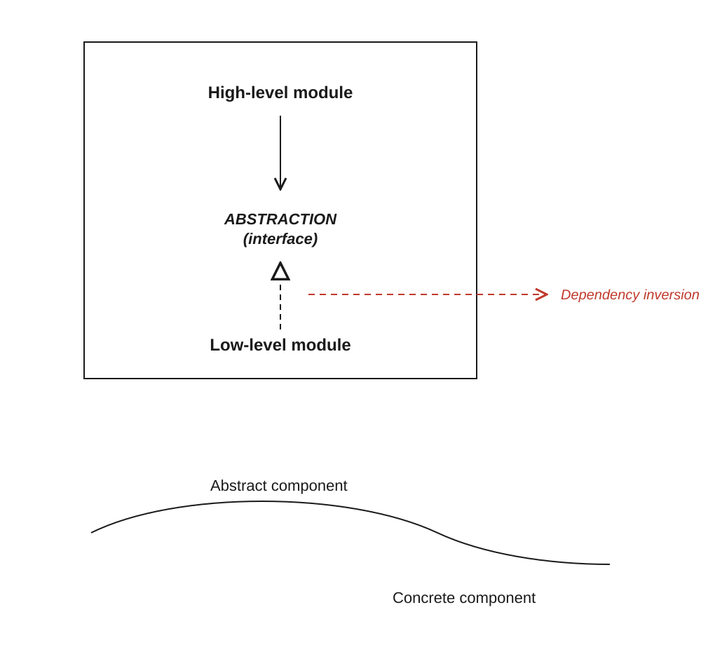
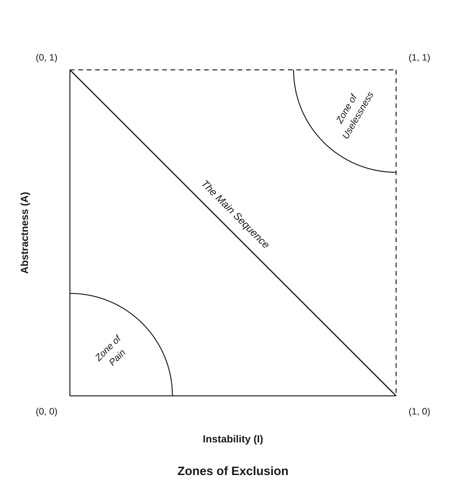

# Clean Architecture Study notes 01

> The only way to go fast is to go well.
>
> – Robert C. Martin (Uncle Bob)

## Notes

**Speculative generality:** countless parameters, hard-coded guess work

Humans are good at operating with incomplete knowledge. We learn more by exploring and experimenting.

Good architecture is flexible, it comes from understanding it more as a journey, not a destination.

The goal of software architecture is to minimise the human resources required to build and maintain the required system.

**The signature of a mess:** when systems are thrown together in a hurry and more and more developers are added to the project without thought or care for the cleanliness of the code.

"We go live first, then we clean up" is a tell tale sign of the signature of a mess.

**Value in software to stakeholders:**

1. Behaviour (function)
2. Architecture (ease of change)

It is far more important for software to be easy to change than for it to work. If it's easy to change, it is easy to make it work.

Software architects are more focused on the structure of the system rather that the features and functions of it.

If the architecture becomes too hard to change, or change itself causes too many bugs, the cost of change will be disproportionally high compared to the added value of the feature.

## Design Principles

### SOLID

| Initial | Principle                       | Abbrebiation |
| ------- | ------------------------------- | ------------ |
| **S**   | Single Responsibility Principle | SRP          |
| **O**   | Open/Close Principle            | OCP          |
| **L**   | Liskov Substitution Principle   | LSP          |
| **I**   | Interface Segregation Principle | ISP          |
| **D**   | Dependency Inversion Principle  | DIP          |

#### Single Responsibility Principle (SRP)

A module should be responsible to ONE, and ONLY ONE actor.

#### Open/Close Principle (OCP)

A software artifact should be open for extension but closed for modification.

The goal is to make the system easy to extend without incurring a high impact of change. This goal is accomplished by partitioning the system into components, and arranging those components into a dependency hierarchy that protects higher-level components from changes in lower-level components.

#### Liskov Substitution Principle (LSP)

Functions that use pointers to base classes must be able to use objects or derived classes without knowing it.
This principle is about OOP and class inheritance.

Subclass extending superclass if used by the program interchangeably should not break the program.

**Bad example:**
Rectangle (setW, setH) != Square (setSize)

#### Interface Segregation Principle (ISP)

Clients should not be forced to depend on interfaces that they don't use.

**Example 1:**

Break up a big interface/object into multiple interfaces/objects, grouped by responsibility or concern of the consuming classes and components.

**Example 2:**

Instread of passing in a big object into a component and make it cherry pick what it needs from that object, pass in exactly what it needs and no more.

#### Dependency Inversion Principle (DIP)

High-level modules should depend on abstractions rather than concrete implementations.

**Stable abstractions > Fragile concretions**

The source code dependencies are inverted against the flow of control.

## Component Principles

The **SOLID** principles help with arranging bricks into walls and rooms. **Component Principles** help with the arrangement of the rooms into buildings.

Components are units of deployment, they are the smallest entities that can be deployed as part of a system.

**Examples:** JAR/Gem/DLL files (not so webby)

Components are independently deployable and can be developed independently.

### The 3 Principles of Component Cohesion

| Principle                | Abbrebiation |
| ------------------------ | ------------ |
| Reuse/Release Principle  | REP          |
| Common Closure Principle | CCP          |
| Common Reuse Principle   | CRP          |

#### Reuse/Release Principle (REP)

Modules and classes that belong together in the same component should be reused and released together.

#### Common Closure Principle (CCP)

**This is the component equivalent of the SRP.** If classes change for different reasons, they should be kept in separate components.

#### Common Reuse Principle (CRP)

**This is the component equivalent of the ISP.** If a class or module doesn't need another module or class, it should not depend on it.

## Dependency Management Principles

| Principle                      | Abbrebiation |
| ------------------------------ | ------------ |
| Acyclic Dependencies Principle | ADP          |
| Stable Dependencies Principle  | SDP          |
| Stable Abstractions Principle  | SAP          |

### Acyclic Dependencies Principle (ADP)

Allow no cycles in the component dependency graph.

If multiple components depend on each other, you have to remove the cyclical dependency by either:

1. Use DIP – create an interface that abstracts the implementation (concretion) in one component and let both components interact with the interface; or
2. Create a new component and let both component's interact with that.

### Stable Dependencies Principle (SDP)

> Depend in the direction of <u>stability</u>.

#### Stability and Frequency of Change

- **Stable/unstable:** If a component is depended upon by many other components, it is responsible to those components and therefore it is <u>stable</u>. Stable components are less likely to change frequently. If a component is not a dependency to any other component it is irresponsible, and therefore it is <u>unstable</u>. Unstable components are easier to change and they are likely to change more frequently.

If you have to make a decision about setting a dependency between components, <u>go with the more stable component</u> as it's less likely to change. Even when the change requires large effort it will be less painful to deal with itm because it'll happen less frequently.

#### Stability Metrics

- **Fan-in:** incoming dependencies
- **Fan-out:** outgoing dependencies
- **Instability:** I (0-1 – 0 = super stable; 1 = super unstable)

**Instability formula:**

$$
I = \frac{\text{Fan-out}}{\text{Fan-in} + \text{Fan-out}}
$$

**Example:**

**Component A** depends on 1 other component and 3 other components depend on **Component A**. Component A's `I = 0.25`, which makes it fairly stable:

$$
I = \frac{\text{1}}{\text{3} + \text{1}}
$$

The **Stable Dependency Principle** says that the `I` metric of a component should be larger than the `I` metric of the component it depends on.

> **SDP:** The `I` metric should decrease in the direction of dependency.

### Stable Abstractions Principle (SAP)

**This principle's main concerns are:**

- Stability
- Abstractness
- Flexibility

**DIP** is for classes what **SAP** is for components.

A stable component should be <u>abstract</u> to allow it to be extended – this makes the component <u>flexible</u>.

#### Measuring Abstraction

- **Nc:** the total number of classes in a component
- **Na:** the number of abstract classes and interfaces in a component
- **A:** abstractness (0-1 = 0 = no abstract classes; 1 = only abstract classes)

**Abstractness formula:**

$$
A = \frac{\text{Na}}{\text{Nc}}
$$

### The Zones of Exclusion

#### The Zone of Pain

Components that are <u>highly stable and conctrete</u> are too rigid and end up in **The Zone of Pain**. Components in this zone cannot be extended, because they are not <u>abstract</u>, and it is very difficult to change them due to their high-level of <u>stability</u>.

**Examples:**

- Database schemas
- Utility libraries (i.e. String component)

#### The Zone of Uselessness

Components in this zone are too abstract with too few dependets. Components in the **The Zone of Uselessness** can be components no one uses – they might have stopped using them a while back but forgot to remove them and now they are just sitting in the codebase.

Components should avoid both **Zones of Exclusion** and be as close to the **Main Sequence** as possible (in an ideal world).

The metric of being close the the **Main Sequence** is **Distance**.

Distance from the Main Sequence is calculated using the Component's Abstraction and Instability values (0-1 – 0 = right on the Main Sequence; 1 = very far from the Main Sequence).

$$
D = \left| A + I - 1 \right|
$$

Use <u>Distance</u> to measure each components' conformance to the **Main Sequence**.

> Note: Monitoring value of `D` over time to keep it within control linits helps to decide when a component should be refactored.

---

#### Notes on languages and the relevance of the principles discussed in this book

Many concept & principles apply to C# or Java because of the compiling + bundling nature of these languages. Some of these principles will not directly apply to JavaScript on the application level, but zooming out to container and system level they become more applicable.

C#, Java, Go, Rust, Kotlin and TypeScript are <u>statically typed languages</u>. (If there is a compiler involved that performs type checks, it is very likely it is a statically typed language.)

JavaScript, Python, Ruby, PHP and Lua are <u>dynamically typed languages</u>.

In dynamic languages, abstract components don't exist or even if they do they are very simple.

