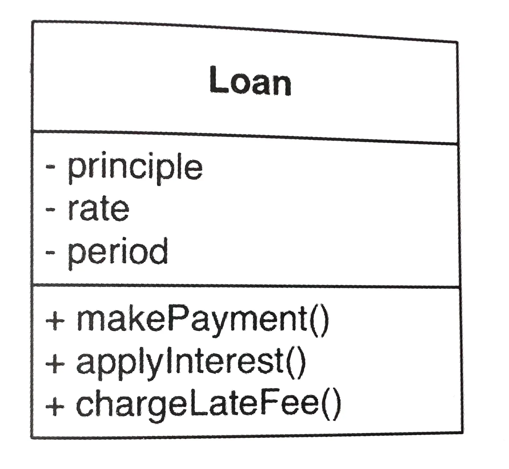
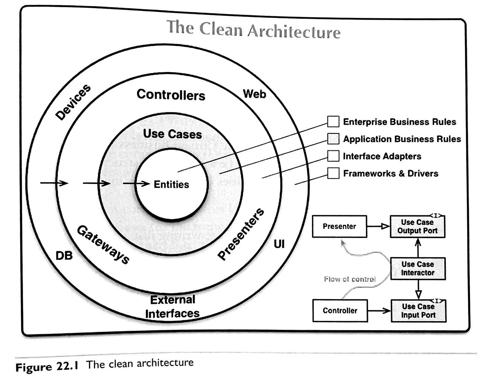
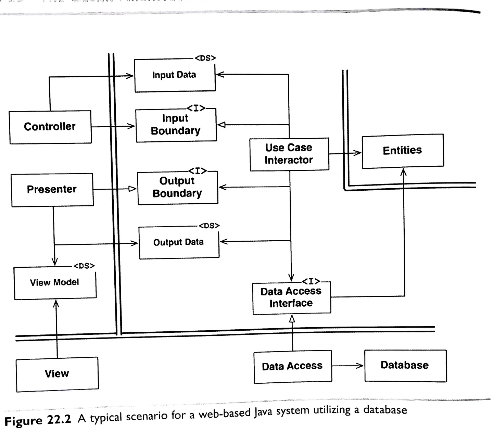

# Clean Architecture Study notes 02

## Architecture - Part V (Chapter 15+)

The primary purpose of architecture is to support the lifecycle of the system.

Good architecture makes the system easy to:

- understand,
- develop,
- maintain,
- deploy.

> The ultimate goal is to minimise the lifetime cost of the system and to maximise programmer productivity.

### The main concerns of software architecture

#### Development

The architecture of a system should make it easy and cheap for teams to build it.

#### Deployment

The system should be easy and cheap to deploy.

> Think about deployment as early as possible as it really can cost if deferred.

#### Operation

A good software architecture communicates the operational needs of the system. The architecture should elevate the system's use cases, features and required behaviours.

#### Maintenance

Good architecture lowers the cost of time spent on understanding impact of change, or changing the system itself.

### Keeping options open

Software is <u>soft</u> because it is easy to change. Keeping options open for as long as possible helps with that. The later a decision is made, the more information is available to support that decision, and the more flexible the system can stay.

### Software systems

**Policy:** Business rules and procedures, rarely changes
**Detail:** Implementation of policy, can change often

> You want to <u>lock down</u> **policy** and keep **detail** <u>open</u>.

> You want to <u>disconnect/decouple</u> **policy** from **detail** as much as possible.

## Independence / Decoupling

Decoupling layers, modes and use cases helps with <u>independence</u>. One example of this is using micro-services, or **_service-oriented architecture_**.

## Duplication

True vs. false (a.k.a. accidental) duplication are not the same and should be carefully considered.

**True duplication:** when the duplicate code changes differently over time the are not true duplicates, and should be left alone.

> Eliminating <u>true duplication</u> might make sense as cleans the code, encourages code re-use and it allows a single-source of truth approach, but it creates coupling of use cases that might need to change differently over time.

> Coupling accidental duploication makes no sense in the long term, so developers should avoid the urge to eliminate duplication early without carefully considering the consequences.

### Decoupling Modes

These are a bit hard to relate to in the web development world, but on an abstract level they are useful.

**Source level:**

"Monolythic structure" – originates from memory adressing but it can be translated to making unrelated code separate from other code to minimise the impact of change. For example: unit tests should still pass in Component A when Component B changed.

**Deployment level:**

Again, we're not working with Jar or DLL files, but this level could apply to shared assets and resources, such as scripts or packages loaded into the application at run time.

**Service level:**

Coupling happens on the data-structure level. For example: micro-services.

> Defer & delay decisions that can be deferred to keep options open and save time and money down the line.

One delayed decision example is using an interface between the application and the database. This approach allows the database to be swapped at any time with minimal inpact to the application.

[P164 - FitNesse]

> Draw a line between <u>business rules</u> and solutions to defer decisions for as long as possible.

## Boundary Anatomy

> The **architecture** of a system is defined by a set of **components** and the **boundaries** that <u>separate them</u>.

This chapter has gone well over my head, but my basic understanding of it is this: boundaries are set between components and services; there are also boundaries within the building blocks of components and services.

## Business Rules

> Critical Business Rules + Critical Business Data = Entity (Class)



Some business rules are critical to business regardless if they are automated or manually implemented. Some business rules only apply to automation.

## Use Case

Use cases are application-specific business rules. They contain the rules that specify how and when the **Critical Business Rules** within the <u>Entities</u> are invoked.

> <u>Use cases</u> know about <u>Entities</u>, but <u>Entities</u> don't know about <u>Use cases</u>.

Use cases describe the application-specific rules that govern the interaction between the user and the entities.

Use cases are low-level, Entities are high-level. Use cases are application-specific, Entities are generalisations that can be used in many applications.

> Business Rules are the reason a software system exists.

### The Dependency Rule

> Source code dependencies must only point inward, toward the higher-level policies.

## Screaming Architecture

> Software architectures are structures that support the use cases of the system.
>
> – Ivar Jacobson - Object-Oriented Software Engineering

Blueprints of buildings scream "HOME" and "LIBRARY"
Software architecture scream "FLIGHT BOOKING" and "GROCERIES APP"

Good architectures are centred on use cases, not frameworks or tools.

Frameworks are decisions to be left open.

> 💡 Tip: Detach the architecture from the frameworks or tools.

## The Clean Architecture



All dependencies cross boundaries pointing inwards as per the **Dependency Rule**.



## Presenters and Humble Objects

### The Humble Object Pattern

Break the easy to test parts from the hard to test parts into separate modules.

**Example:**

```text
  [Presenter]   ->    [View Model]    ->    [View]
  Testable                                  Humble
  object                                    object
```

**Note:** We can also test UI stuff, but this is from a traditional programmer's perspective.

## Services

> The architecture of a system is defined by boundaries that separate <u>higher-level **policy**</u> from the <u>lower-level **detail**</u> and follows the **Dependency Rule**.

[Action: Turn the diagram breakdown on page 245 into a case study]

Architectural boundaries run through services, dividing them into components.

Services must be designed with internal component architectures that follow the **Dependency Rule**. The services do not define the architectural boundaries of the system, the components inside them do.

```text
  [CONCRETION]    ->    [ABSTRACTION]
```

---

<style>
  .diagram {
    max-width: 50%;
    display: block;
    margin: 1.4rem auto;
    border-radius: 8px;
    border: 2px solid lime;
  }
</style>
